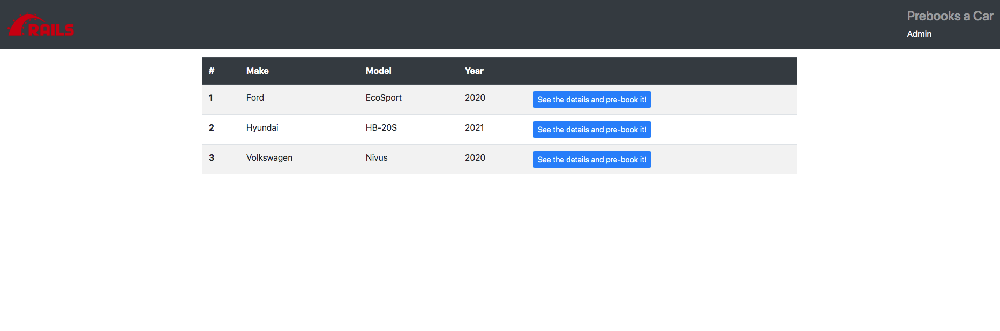

<p align="center"></p>

# Rails Demo App

# Summary
```
The main target was developing a simple rails app with local storage, http based AUTH, nested models and do not use scaffold in the process. For accessing the /admin path or any other protected one please use the following auth info: *user*:admin, *password*:nimda

```

---------

## Software Stack

* Rails 6.0.3.5
* Ruby 2.7.1p83
* Gem 3.1.2
* SQLite3 3.23.3
* Yarn 1.22.5

-----------


## Backend instructions
-----------

### Database - MySQL
```
1. mysql -uroot -p
2. CREATE DATABASE tasklist;
3. CREATE USER 'tasklist'@'localhost' identified WITH mysql_native_password by 'tasklist';
4. GRANT ALL on tasklist.* to 'tasklist'@'localhost';
5. quit
```
### Ruby/Rails
```
1. Go to root folder
2. Execute 'rails -s'

Verify on http://localhost:3000
